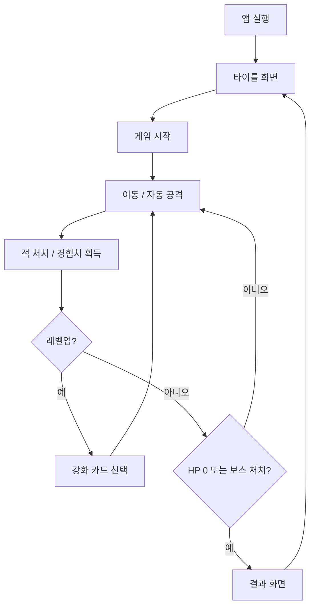
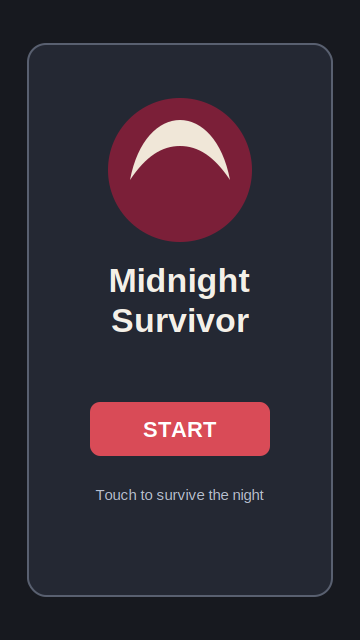
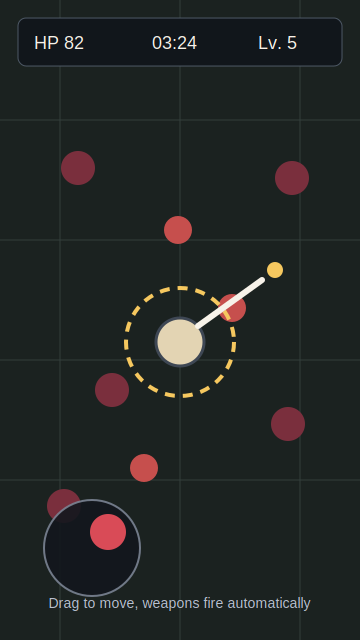
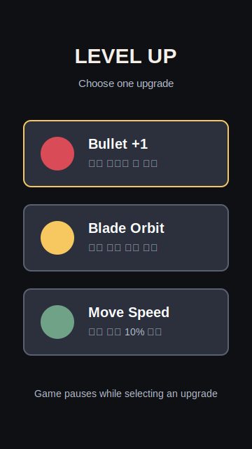
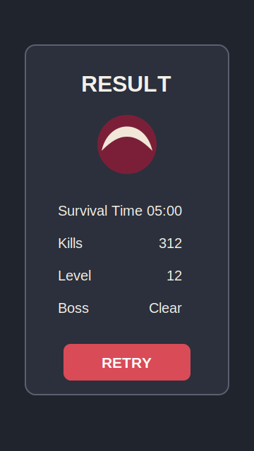

# Midnight Survivor

## 과제 본문 링크

| 항목 | 내용 |
| --- | --- |
| 프로젝트 제목 | **Midnight Survivor** |
| 발표 영상 자료 | [발표 영상 링크](https://youtu.be/9x30k_GNS_U?si=-yoUY7hPOzfsyo6O) |
| 프로젝트 Git Repository | [GitHub Repository](https://github.com/boowerk/SmartPhoneGamePrograming_TermProject) |
| README.md | [README.md](./README.md) |
| 개발 범위 | [개발 범위 보기](#개발-범위) |

> 위의 발표 영상 링크와 Git Repository 링크는 제출 전 실제 업로드/저장소 주소로 교체합니다.

## 게임 컨셉

**High Concept**  
`Midnight Survivor`는 뱀파이어 서바이벌류 자동 공격 생존 액션 게임입니다. 플레이어는 세로 화면에서 터치 드래그로 캐릭터를 이동시키고, 무기는 자동으로 발사됩니다. 제한 시간 동안 몰려오는 적을 피하면서 경험치를 모아 성장하고, 마지막 보스를 처치하거나 제한 시간까지 생존하는 것이 목표입니다.

**레퍼런스**  
핵심 감각은 `탕탕특공대`처럼 한 손 조작, 자동 공격, 빠른 성장 선택, 대량 적 웨이브를 중심으로 구성합니다. 단, 수업에서 만드는 Android CustomView 기반 게임 프레임워크를 사용해 직접 구현 가능한 범위로 축소합니다.

**핵심 메카닉**

- 이동: 화면 하단 가상 조이스틱 또는 터치 드래그 기반 8방향 이동
- 전투: 가장 가까운 적 또는 지정 패턴을 향한 자동 공격
- 성장: 경험치 보석 획득 후 레벨업 시 3개 강화 카드 중 1개 선택
- 생존 압박: 시간이 지날수록 적 수, 이동 속도, 체력이 증가
- 충돌: 플레이어-적, 투사체-적, 경험치 보석-플레이어 충돌 처리
- 결과: 생존 시간, 처치 수, 획득 레벨을 결과 화면에 표시

## 개발 범위

수업 Git Repository의 README에서 이번 학기에 다루는 `CustomView based Game App`, `postDelayed()/Choreographer`, `Frame Time/FPS`, `Move based time`, `GameObject`, `Sprite`, `MainGame`, `Touch Event handling`, `Frame Animation`, `Game Framework`, `Object Lifecycle Management`, `GameObject Layering`, `Score/Font Drawing`, `Background Layering`, `Collision Check/Handling`, `Multiple Scene` 내용을 기준으로 개발 범위를 정합니다.

| 분류 | 구현 범위 | 정량 목표 |
| --- | --- | --- |
| 플랫폼 | Android 세로 화면 게임 | 1개 Activity, CustomView 기반 |
| 프레임워크 | 수업 Game Framework 사용 | `MainGame`, `GameObject`, `Sprite`, Scene 구조 적용 |
| 입력 | 터치 이동 | 드래그/가상 조이스틱 1종 |
| 플레이어 | 생존자 캐릭터 | 1종, HP/이동속도/레벨/경험치 보유 |
| 무기 | 자동 공격 무기 | 기본 총알, 회전 칼날, 범위 오라 총 3종 |
| 강화 | 레벨업 선택지 | 무기별 3단계, 공통 강화 3종 |
| 적 | 일반 적/돌진 적/원거리 적/엘리트 | 최소 4종 |
| 보스 | 제한 시간 후 등장 | 1종 |
| 웨이브 | 시간 기반 적 생성 | 5분 플레이 기준 10개 웨이브 |
| 아이템 | 경험치/회복 아이템 | 2종 |
| 충돌 | 원형 또는 사각 충돌 | 플레이어, 적, 투사체, 아이템 적용 |
| UI | 게임 HUD와 결과 표시 | HP, 시간, 레벨, 처치 수, 강화 선택, 결과 화면 |
| 씬 | 화면 전환 | 타이틀, 게임, 레벨업 팝업, 결과 총 4개 상태 |
| 리소스 | 이미지 스프라이트/효과음 | 플레이어/적/무기/아이템/배경 기본 리소스 |

## 예상 게임 실행 흐름

1. 앱 실행 후 타이틀 화면에서 `Start`를 누릅니다.
2. 게임 화면으로 전환되며 플레이어가 중앙에 생성됩니다.
3. 플레이어는 터치 드래그로 이동하고, 무기는 자동으로 가장 가까운 적을 공격합니다.
4. 적 처치 시 경험치 보석 또는 회복 아이템이 드롭됩니다.
5. 경험치를 모아 레벨업하면 게임이 잠시 멈추고 강화 카드 3개가 표시됩니다.
6. 강화 선택 후 게임이 재개되고 더 강한 웨이브가 등장합니다.
7. 5분 생존 시 보스가 등장합니다.
8. 보스를 처치하거나 플레이어 HP가 0이 되면 결과 화면으로 이동합니다.

## 게임 화면 흐름 스케치

아래 이미지는 실제 구현 전 발표 영상에 사용할 화면 흐름 스케치입니다. 구현 후에는 실제 게임 실행 스크린샷으로 교체합니다.

| 단계 | 화면 | 설명 |
| --- | --- | --- |
| 1 |  | 게임 제목과 시작 버튼 표시 |
| 2 |  | 이동, 자동 공격, 적 웨이브, HUD 표시 |
| 3 |  | 3개 강화 카드 중 1개 선택 |
| 4 |  | 생존 시간, 처치 수, 레벨 표시 |

## 발표 영상 구성

발표 동영상은 **1분 30초**를 목표로 제작합니다. 감점 기준을 피하기 위해 최종 영상 길이는 **1분 25초에서 1분 35초 사이**로 맞춥니다.

| 시간 | 화면 자료 | 발표 내용 |
| --- | --- | --- |
| 0:00-0:10 | 타이틀 화면 | 프로젝트 제목과 장르 소개: 한 손 조작 자동 공격 생존 액션 |
| 0:10-0:25 | 레퍼런스/컨셉 설명 | 탕탕특공대식 조작감과 뱀파이어 서바이벌식 성장 구조 설명 |
| 0:25-0:45 | 전투 화면 스케치 | 터치 이동, 자동 공격, 적 웨이브, 경험치 획득 설명 |
| 0:45-1:00 | 레벨업 화면 스케치 | 3개 강화 카드 중 선택하여 빌드를 만드는 핵심 메카닉 설명 |
| 1:00-1:15 | 개발 범위 표 | 수업 프레임워크 기반 GameObject, Sprite, 충돌, 레이어, 씬 전환 구현 범위 설명 |
| 1:15-1:30 | 일정/결과 화면 | 8주 개발 일정과 최종 목표 화면 설명 |

### 1분 30초 발표 대본

안녕하세요. 제 프로젝트는 `Midnight Survivor`입니다. 뱀파이어 서바이벌류 생존 액션을 Android 세로 화면에 맞춘 게임으로, 레퍼런스는 탕탕특공대입니다. 플레이어는 화면을 드래그해서 캐릭터를 이동시키고, 무기는 자동으로 발사됩니다.

게임의 핵심은 몰려오는 적을 피하면서 경험치를 모으고, 레벨업할 때마다 3개의 강화 카드 중 하나를 선택해 빌드를 만드는 것입니다. 기본 총알, 회전 칼날, 범위 오라 같은 자동 공격 무기를 구현하고, 시간이 지날수록 적 웨이브가 강해지도록 만들 예정입니다.

개발은 수업에서 만드는 CustomView 기반 게임 프레임워크를 사용하는 것을 원칙으로 합니다. `MainGame`, `GameObject`, `Sprite`, 터치 이벤트, 프레임 시간 기반 이동, 오브젝트 생명주기 관리, 레이어링, 충돌 처리, 점수와 폰트 출력, 여러 씬 전환을 포함합니다.

최종 목표는 5분 플레이 가능한 프로토타입입니다. 타이틀 화면에서 시작해 전투, 레벨업 선택, 보스 등장, 결과 화면까지 이어지는 한 사이클을 완성하겠습니다. 4월 6일 주차부터 8주 동안 프레임워크 적용, 전투 구현, 성장 시스템, 웨이브와 보스, UI와 밸런싱 순서로 개발하겠습니다.

## 개발 일정

4월 6일에 시작하는 주를 1주차로 하여 8주간 개발합니다.

| 주차 | 기간 | 개발 목표 | 산출물 |
| --- | --- | --- | --- |
| 1주차 | 2026-04-06 ~ 2026-04-12 | 프로젝트 기획 확정, 수업 프레임워크 구조 파악, 화면 비율/좌표계 결정 | README 기획서, 화면 스케치 |
| 2주차 | 2026-04-13 ~ 2026-04-19 | CustomView 기반 게임 루프 구성, `MainGame`/`GameObject` 기본 구조 적용 | 빈 게임 화면, FPS/프레임 시간 확인 |
| 3주차 | 2026-04-20 ~ 2026-04-26 | 플레이어 이동과 카메라/배경 구현, 터치 입력 처리 | 플레이어 이동 가능 빌드 |
| 4주차 | 2026-04-27 ~ 2026-05-03 | 자동 공격 무기 1종, 일반 적 2종, 충돌 처리 구현 | 기본 전투 가능 빌드 |
| 5주차 | 2026-05-04 ~ 2026-05-10 | 경험치, 레벨업, 강화 카드 선택 UI 구현 | 성장 루프 포함 빌드 |
| 6주차 | 2026-05-11 ~ 2026-05-17 | 무기 3종, 적 4종, 웨이브 테이블, 오브젝트 재사용 구현 | 5분 웨이브 플레이 빌드 |
| 7주차 | 2026-05-18 ~ 2026-05-24 | 보스, 결과 화면, 사운드/이펙트, 난이도 밸런싱 | 시작-전투-결과 완성 빌드 |
| 8주차 | 2026-05-25 ~ 2026-05-31 | 버그 수정, 발표 영상 촬영, README 최종 정리 | 최종 제출본, 1분 30초 발표 영상 |

## 수업 내용 반영 계획

- `CustomView based Game App`: Android View의 `onDraw()`를 중심으로 게임 화면을 직접 렌더링합니다.
- `postDelayed()` 또는 `Choreographer`: 일정한 프레임 갱신과 프레임 시간 계산에 사용합니다.
- `Move based time`: 기기 성능 차이에 따라 이동 속도가 달라지지 않도록 delta time 기반으로 이동합니다.
- `GameObject`/`Sprite`: 플레이어, 적, 투사체, 아이템을 공통 객체 구조로 관리합니다.
- `Touch Event handling`: 플레이어 이동 입력을 처리합니다.
- `Frame Animation`: 캐릭터, 적, 무기 이펙트 애니메이션에 사용합니다.
- `Object Lifecycle Management`: 적, 투사체, 아이템을 생성/삭제하거나 재사용합니다.
- `GameObject Layering`: 배경, 아이템, 적, 플레이어, 투사체, UI 순서로 그립니다.
- `Score / Font Drawing`: 생존 시간, 처치 수, 레벨, HP를 화면에 출력합니다.
- `Collision Check / Collision Handling`: 공격, 피격, 아이템 획득을 처리합니다.
- `Multiple Scene`: 타이틀, 게임, 레벨업, 결과 화면을 상태 또는 Scene으로 분리합니다.

## 제출 전 체크리스트

- [ ] 발표 영상 링크를 실제 URL로 교체
- [ ] GitHub Repository 링크를 실제 URL로 교체
- [ ] 구현 후 스케치 이미지를 실제 게임 스크린샷으로 교체
- [ ] 발표 영상 길이를 1분 20초 이상 1분 40초 이하로 확인
- [ ] README의 개발 범위와 실제 구현 범위가 일치하는지 확인
- [ ] 수업 프레임워크 사용 여부를 코드와 README에서 확인

## 참고 자료

- [수업 Git Repository](https://github.com/scgyong-kpu/spgp_2026)
- [수업 README a01](https://raw.githubusercontent.com/scgyong-kpu/spgp_2026/a01/README.md)
- [수업 README a02](https://raw.githubusercontent.com/scgyong-kpu/spgp_2026/a02/README.md)
