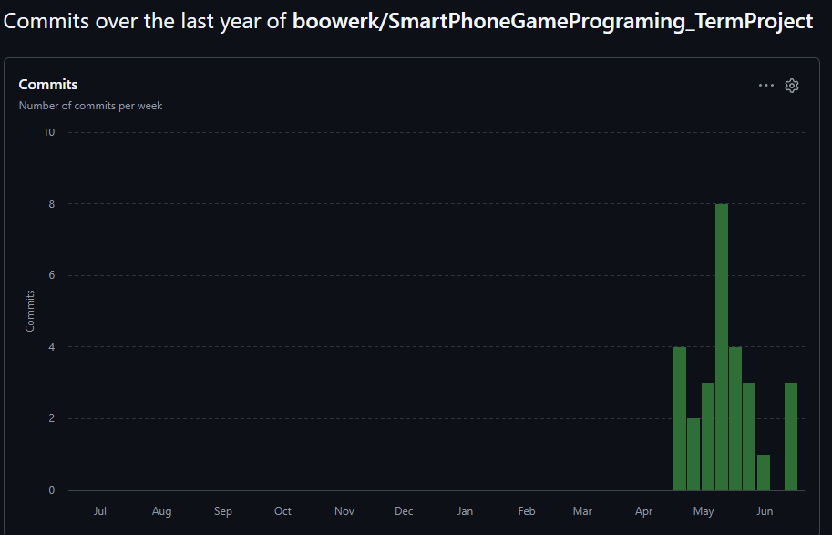

# Midnight Survivor

`Midnight Survivor`는 Kotlin 기반 Android `CustomView` 프레임워크로 만든 2D 생존 액션 게임입니다.  
기본 방향은 `Vampire Survivors`와 `탕탕특공대` 계열의 자동 공격 생존 게임이지만, 이번 프로젝트에서는 안드로이드 터치 조작, 수업에서 만든 프레임워크, 반복 보스전, 무한 모드에 맞춰 재구성했습니다.

## 제출 본문

| 항목 | 링크 |
| --- | --- |
| 프로젝트 제목 | **Midnight Survivor** |
| Git Repository | [SmartPhoneGamePrograming_TermProject](https://github.com/boowerk/SmartPhoneGamePrograming_TermProject) |
| 1차 README | [1차 발표 당시 README](https://github.com/boowerk/SmartPhoneGamePrograming_TermProject/blob/a330f20/README.md) |
| 1차 발표 영상 | [1차 발표 영상](https://youtu.be/9x30k_GNS_U?si=-yoUY7hPOzfsyo6O) |
| 2차 README | [2차 발표 당시 README](https://github.com/boowerk/SmartPhoneGamePrograming_TermProject/blob/832453f/README.md) |
| 2차 발표 영상 | [2차 발표 영상](https://youtu.be/HZ5cnlDDAu0) |
| 3차 README | [최종 README](https://github.com/boowerk/SmartPhoneGamePrograming_TermProject/blob/main/README.md) |
| 3차 발표 영상 | [최종 발표 영상](https://youtu.be/XRQ1ERmW2R0) |

## 게임에 대한 간단한 소개

플레이어는 화면을 드래그해 캐릭터를 이동시키고, 공격은 자동으로 발사됩니다.  
적을 처치해 경험치를 모으고 레벨업 카드로 빌드를 강화하며, 시간이 지날수록 더 강한 적과 보스가 반복해서 등장하는 무한 모드를 최대한 오래 버티는 것이 목표입니다.

### 레퍼런스 게임과의 차이점

- `탕탕특공대`처럼 모바일 터치 조작과 자동 공격을 사용합니다.
- `Vampire Survivors`처럼 적의 밀도와 빌드 선택이 생존 시간에 직접 영향을 줍니다.
- 이번 프로젝트에서는 원래 5분 생존 클리어 구조를 생각했지만, 최종적으로는 장르 특성에 더 맞는 `무한 모드`로 변경했습니다.
- 수업에서 만든 `MainGame / Scene / GameObject / Sprite` 구조 위에서 구현한 점이 가장 큰 차이입니다.

## 현재 빌드 기준 핵심 플레이

| 항목 | 내용 |
| --- | --- |
| 조작 | 화면 드래그 기반 이동 |
| 기본 무기 | Moon Shot 자동 발사 |
| 추가 무기 | Orbit Blade, Moon Aura, Storm Axe, Moon Knife, Phantom Spear |
| 일반 적 | Chaser, Dasher, Tank, Ranger, Skeleton, Shaman, Ogre |
| 보스 | 반복 등장하는 Crimson Overlord |
| 성장 | 레벨업 카드 3개 중 선택 |
| 오디오 | `blood_arcade` 배경음악, 공격/버튼/경험치 획득 효과음 적용 |
| 목표 | 무한 모드에서 최대한 오래 생존 |
| 결과 화면 | 생존 시간, 처치 수, 레벨, 보스 격파 수, 무기 빌드 요약 |

## 개발 범위

수업 Git 저장소 [spgp_2026](https://github.com/scgyong-kpu/spgp_2026)의 프레임워크 진행 내용을 기준으로, 이번 프로젝트의 개발 범위를 아래처럼 잡았습니다.

| 범위 | 목표 | 실제 구현 |
| --- | --- | --- |
| Android 게임 프레임워크 | `CustomView`, 게임 루프, Scene 전환 | 완료 |
| 플레이어 조작 | 터치 이동, 카메라 추적 | 완료 |
| 전투 루프 | 자동 공격, 적 추적, 충돌 처리 | 완료 |
| 성장 시스템 | 경험치, 레벨업, 강화 카드 | 완료 |
| 적 다양화 | 일반 적 4종 이상, 패턴 차별화 | 7종 구현 완료 |
| 보스전 | 중간 보스 또는 반복 보스 | 반복 보스 구현 완료 |
| 모드 구조 | 최소 1개 완성도 있는 게임 모드 | 무한 모드 완성 |
| 결과/요약 | 결과 화면과 플레이 요약 | 완료 |
| 제출용 문서화 | README 기반 발표 자료 | 최종 정리 |

## 개발 계획 / 일정 / 실제 진행

### 초기 계획과 실제 진행 비교

| 항목 | 초기 계획 | 실제 진행 | 진행 결과 |
| --- | --- | --- | --- |
| 프레임워크 적응 | 수업용 프레임워크 위에 기본 구조 이식 | `MainGame`, `Scene`, `GameObject`, `Sprite` 기반으로 재구성 | 완료 |
| 전투 구현 | 플레이어 1종 무기와 적 추적 | 기본 총알, 충돌, 경험치 루프 구현 | 완료 |
| 성장 구현 | 레벨업 카드 3종 이상 | 카드형 강화 시스템과 6종 무기 빌드 구현 | 완료 |
| 적/보스 확장 | 적 패턴 추가, 보스 1종 구현 | 일반 적 7종, 반복 보스 1종 구현 | 완료 |
| 게임 목표 | 5분 생존 후 클리어 | 무한 모드로 변경 | 방향 변경 후 완료 |
| 발표/제출 정리 | README와 영상 정리 | 1차/2차/최종 README 체계 정리, APK 제출본 재정리 | 진행 중 |

### 목표 변경 내용과 이유

- 원래 목표: `5분 생존하면 클리어되는 구조`
- 변경 목표: `클리어 없는 무한 모드`
- 변경 이유:
  - 장르 레퍼런스가 원래 장시간 생존과 빌드 확장을 중심으로 동작함
  - 기본 전투 루프가 완성된 뒤에는 클리어형보다 무한 모드가 플레이 감각과 반복성이 더 좋았음
  - 발표 시에도 “시간이 지날수록 적과 보스가 강해지는 구조”를 설명하기 쉬웠음

### 4월 6일 시작 기준 주차별 실제 진행

| 주차 | 기간 | 실제 진행 |
| --- | --- | --- |
| 1주차 | 2026-04-06 ~ 2026-04-12 | 아이디어 정리, 발표 준비, 저장소 세팅 전 단계 |
| 2주차 | 2026-04-13 ~ 2026-04-19 | 저장소 생성, 1차 README/영상 업로드 |
| 3주차 | 2026-04-20 ~ 2026-04-26 | Kotlin Android `CustomView` 프로토타입과 Scene 골격 작성 |
| 4주차 | 2026-04-27 ~ 2026-05-03 | 전투 루프, 플레이어/적 스프라이트, 추적 로직 구현 |
| 5주차 | 2026-05-04 ~ 2026-05-10 | 성장 루프, 레벨업 UI, 2차 발표용 README 정리 |
| 6주차 | 2026-05-11 ~ 2026-05-17 | 웨이브 스케줄, 블레이드/오라, 객체 풀링, 신규 에셋 준비 |
| 7주차 | 2026-05-18 ~ 2026-05-24 | 보스 패턴, 전투 피드백, 결과 요약, 신규 무기 기초 구현 |
| 8주차 | 2026-05-25 ~ 2026-05-31 | 회복 드롭, 결과 화면 다듬기, 무한 모드 전환, 보스 반복 루프 |
| 9주차 | 2026-06-01 ~ 2026-06-07 | 추가 정리 및 발표 준비 |
| 10주차 | 2026-06-08 ~ 2026-06-14 | 무기 스프라이트 보강, 사운드 통합, 최종 제출 문서 정리 |

## 주차별 커밋 횟수

GitHub 기준 확인 링크:

- [GitHub Commits](https://github.com/boowerk/SmartPhoneGamePrograming_TermProject/commits/main/)
- [GitHub Insights - Commit Activity](https://github.com/boowerk/SmartPhoneGamePrograming_TermProject/graphs/commit-activity)

아래 표는 위 GitHub 커밋 이력과 인사이트를 기준으로 주차별 커밋 수를 정리한 것입니다.

| 주차 | 기간 | 커밋 수 | 대표 작업 |
| --- | --- | ---: | --- |
| 1주차 | 2026-04-06 ~ 2026-04-12 | 0 | 아이디어 정리 단계 |
| 2주차 | 2026-04-13 ~ 2026-04-19 | 3 | 초기 커밋, 1차 README, 1차 영상 링크 |
| 3주차 | 2026-04-20 ~ 2026-04-26 | 1 | Kotlin `CustomView` 프로토타입 |
| 4주차 | 2026-04-27 ~ 2026-05-03 | 2 | 전투 루프, 플레이어/적 스프라이트 적용 |
| 5주차 | 2026-05-04 ~ 2026-05-10 | 8 | 성장 루프, UI 스킨, 2차 README 정리 |
| 6주차 | 2026-05-11 ~ 2026-05-17 | 4 | 웨이브, 블레이드/오라, 풀링, 에셋 준비 |
| 7주차 | 2026-05-18 ~ 2026-05-24 | 4 | 보스전, 피드백 이펙트, 결과 요약, 신규 무기 기초 |
| 8주차 | 2026-05-25 ~ 2026-05-31 | 4 | 회복 드롭, 결과 화면 정리, 무한 모드 전환 |
| 9주차 | 2026-06-01 ~ 2026-06-07 | 0 | 발표 준비 및 방향 정리 |
| 10주차 | 2026-06-08 ~ 2026-06-14 | 4 | Moon Shot / Blade 스프라이트 보강, 최종 README 정리, 사운드 통합 |

### 주차별 대표 커밋

| 날짜 | 커밋 | 내용 |
| --- | --- | --- |
| 2026-04-21 | `1cce6c7` | `feat: scaffold kotlin customview prototype` |
| 2026-04-28 | `7640b23` | `feat: add combat loop and enemy archetypes` |
| 2026-05-06 | `8db006d` | `feat: add progression loop and level-up rewards` |
| 2026-05-18 | `e40a7e0` | `feat: add boss encounter and enemy projectile patterns` |
| 2026-05-23 | `5764d3b` | `feat: enrich result flow with run summary stats` |
| 2026-05-28 | `2450776` | `feat: add endless monster waves and recurring boss loop` |
| 2026-06-14 | `0a9eb7c` | `feat: add sprites for moon shot and orbit blade` |

## 사용된 기술

- Kotlin
- Android `CustomView`
- `Canvas`, `Paint`, `RectF` 기반 직접 렌더링
- `MotionEvent` 기반 터치 입력 처리
- `deltaTime` 기반 프레임 독립 이동
- `SoundPool`, `MediaPlayer` 기반 효과음 / 배경음악 재생
- Scene stack 구조 (`TitleScene`, `MainScene`, `LevelUpScene`, `ResultScene`)
- 객체 풀링 (`Enemy`, `Projectile`, `CombatEffect`, `ExpGem`)
- Git / GitHub 기반 이력 관리

## 참고한 것들

- `Vampire Survivors`의 자동 공격 생존 구조
- `탕탕특공대`의 모바일 터치 조작 감각
- 수업 저장소 [spgp_2026](https://github.com/scgyong-kpu/spgp_2026)
- Android/Kotlin 공식 문서의 `Canvas`, `View`, `MotionEvent` 사용 방식
- 수업 및 과제에서 사용한 픽셀 아트 에셋

## 수업 내용에서 차용한 것

- `MainGame`, `Scene`, `GameObject`, `Sprite` 구조
- 프레임 타임 기반 업데이트
- 입력 처리와 화면 갱신 루프 분리
- 레이어 순서에 따른 그리기 구조
- 충돌 판정과 오브젝트 생명주기 관리
- Scene 전환 방식과 오버레이 Scene(`LevelUpScene`)

## 직접 개발한 것

- 생존형 전투 루프 전체 연결
- 웨이브 스케줄과 무한 모드 확장 로직
- 반복 등장 보스와 보스 미니언 소환 패턴
- 일반 적 7종의 이동/공격 패턴 구분
- 무기 6종 빌드 확장
- 레벨업 카드 정의와 업그레이드 적용 시스템
- 결과 화면 요약 통계
- `ToneGenerator`, `SoundPool`, `MediaPlayer`를 함께 사용하는 하이브리드 오디오 시스템
- `fall`, `arrow_sound`, `button_sound`, `blood_arcade`를 게임 이벤트에 연결한 오디오 피드백
- 발표와 제출용 README 정리

## 아쉬운 것들

### 하고 싶었지만 못 한 것들

- 스킬 조합 또는 진화 무기 시스템
- 스테이지 테마 2종 이상
- 미니맵, 일시정지 메뉴, 옵션 화면
- 튜토리얼과 적 도감

### 앱을 스토어에 판다면 보충할 것들

- `release keystore` 기반 정식 서명
- 저장/불러오기와 영구 성장
- 광고/과금이 아닌 보상 구조 설계
- 다양한 해상도와 기기별 UX 검증
- 사운드 On/Off, 세부 볼륨 설정 메뉴

### 결국 해결하지 못한 문제 / 버그

- 적 수가 매우 많아질 때 밸런스와 가독성 튜닝이 더 필요함
- 작은 화면에서는 탄막과 적 실루엣이 겹쳐 보일 때가 있음
- 실제 여러 안드로이드 기기에서 장시간 테스트를 충분히 하지 못함

### 프로젝트를 하면서 겪은 어려움

- 중간에 `5분 클리어형`에서 `무한 모드`로 방향을 바꾸면서 일정이 다시 꼬였음
- 기능 자체보다도 “무기를 늘렸을 때 밸런스가 무너지지 않게 유지하는 것”이 더 어려웠음
- 발표 README, 영상, 커밋 날짜, 실제 구현을 동시에 맞추는 정리 작업이 꽤 까다로웠음

## 수업에 대한 내용

### 이번 수업에서 기대한 것

- 안드로이드에서 게임 루프를 직접 다루는 경험
- 단순 앱이 아니라 실제로 움직이는 게임 구조를 만드는 경험

### 얻은 것

- `CustomView` 기반 게임 렌더링과 입력 처리 경험
- Scene 분리, 오브젝트 수명 관리, 충돌 처리에 대한 감각
- “기능 구현”과 “발표/문서 정리”를 같이 맞추는 프로젝트 운영 경험

### 얻지 못한 것 / 아쉬운 것

- 상용 게임 수준의 리소스 파이프라인 경험은 부족했음
- 기기별 성능 최적화와 배포 경험은 더 필요함
- 실제 유저 테스트를 기반으로 밸런스를 다듬는 단계까지는 가지 못함

## APK 파일

- 제출용 APK 경로: `app/build/outputs/apk/debug/app-debug.apk`
- 2026-06-14 기준 재빌드 산출물: `signed debug APK` (`9,164,799 bytes`)
- 현재 저장소에는 `release keystore`가 없으므로, 설치 가능한 `signed debug APK`를 제출 기준으로 사용합니다.
- 파일 크기 때문에 e-class 첨부가 불가능하면, Google Drive 등에 올린 뒤 본문 링크로 교체하면 됩니다.

## 발표 영상 구성안

발표 영상은 `3분 30초 이내`를 기준으로 아래 순서로 정리하면 맞추기 쉽습니다.

| 구간 | 내용 |
| --- | --- |
| 0:00 ~ 0:20 | 게임 제목, 한 줄 소개, 레퍼런스와 차이점 |
| 0:20 ~ 0:50 | 핵심 플레이: 이동, 자동 공격, 성장, 무한 모드 |
| 0:50 ~ 1:30 | 사용 기술과 수업 프레임워크 구조 |
| 1:30 ~ 2:10 | 개발 계획 대비 실제 진행, 목표 변경 이유 |
| 2:10 ~ 2:50 | GitHub 커밋 주차 통계와 대표 구현 커밋 |
| 2:50 ~ 3:20 | 아쉬운 점, 수업에서 얻은 것, 마무리 |

## 실행 방법

1. Android Studio 또는 Gradle 환경에서 프로젝트를 연다.
2. `app` 모듈을 빌드한다.
3. 에뮬레이터 또는 실제 안드로이드 기기에서 실행한다.
4. 화면을 드래그해 이동하고, 자동 공격과 레벨업 카드를 통해 최대한 오래 생존한다.
