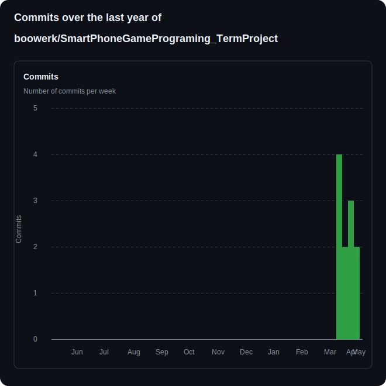
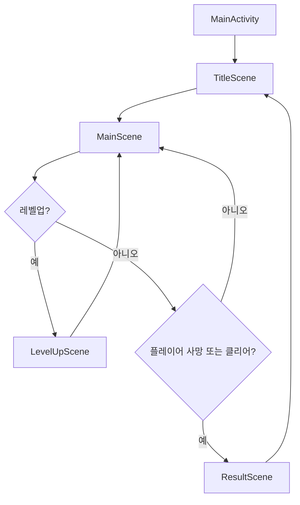

# Midnight Survivor

`Midnight Survivor`는 **Kotlin 기반 Android CustomView 게임**으로 제작하는 2D 생존 액션 프로젝트입니다.  
2차 발표 자료는 별도 PPT 없이 이 `README.md` 안에 정리합니다.

## 과제 본문

| 항목 | 링크 |
| --- | --- |
| 프로젝트 제목 | **Midnight Survivor** |
| README.md | [README.md](https://github.com/boowerk/SmartPhoneGamePrograming_TermProject/blob/main/README.md) |
| 프로젝트 Git Repository | [SmartPhoneGamePrograming_TermProject](https://github.com/boowerk/SmartPhoneGamePrograming_TermProject) |
| 2차 발표 영상 자료 | [2차 발표 영상 링크](https://youtu.be/HZ5cnlDDAu0) |
| 1차 발표 영상 자료 | [1차 발표 영상](https://youtu.be/9x30k_GNS_U?si=-yoUY7hPOzfsyo6O) |
| 1차 발표 당시 README.md | [1차 발표 버전 README](https://github.com/boowerk/SmartPhoneGamePrograming_TermProject/blob/a330f20/README.md) |

> `2차 발표 영상 자료`는 실제 업로드가 끝난 뒤 최종 URL로 교체합니다.

## 게임 소개

`Midnight Survivor`는 세로 화면에서 한 손으로 조작하는 뱀파이어 서바이벌 계열 게임입니다.  
플레이어는 드래그 입력으로 캐릭터를 움직이고, 무기는 자동으로 공격합니다. 적을 피하면서 경험치를 모아 레벨업하고, 강화 카드를 선택해 점점 강해지는 웨이브를 버티는 것이 핵심입니다.

이번 프로젝트는 **Kotlin**으로 만들고, 교수님 GitHub 수업 저장소에서 다룬 게임 프레임워크 구조를 기준으로 구현합니다.

- 수업 저장소: [spgp_2026](https://github.com/scgyong-kpu/spgp_2026)
- 01반 README: [a01 README](https://raw.githubusercontent.com/scgyong-kpu/spgp_2026/a01/README.md)
- 핵심 반영 항목: `CustomView based Game App`, `postDelayed()/Choreographer`, `Frame Time/FPS`, `Move based time`, `GameObject`, `Sprite`, `MainGame`, `Touch Event handling`, `Object Lifecycle Management`, `GameObject Layering`, `Collision Check/Handling`, `Multiple Scene`

## 현재까지의 진행 상황

아래 진행률은 **현재 Git 저장소에 반영된 내용 기준**입니다.

| 항목 | 진행률 | 설명 |
| --- | ---: | --- |
| 프로젝트 컨셉 정리 | 90% | 장르, 목표 플레이, 핵심 메카닉 정리 완료 |
| 교수님 프레임워크 분석 | 75% | 수업 저장소의 핵심 구조를 `MainGame`, `Scene`, `GameObject`, `Sprite` 형태로 반영함 |
| Activity 구성 구현 | 90% | `MainActivity`와 `GameView` 기반 단일 Activity 구조 구현 |
| Scene 구성 구현 | 80% | `TitleScene`, `MainScene`, `LevelUpScene`, `ResultScene` 기본 흐름 구현 |
| MainScene 오브젝트 구현 | 75% | 플레이어, 적, 투사체, 경험치 보석, HUD 로직이 동작하는 1차 프로토타입 작성 |
| README 발표 자료 정리 | 95% | 2차 발표 요구사항 기준으로 문서 구성 완료 |
| 실제 Kotlin 구현 코드 | 45% | 플레이어 이동, 자동 공격, 적 추적, 경험치/레벨업, 결과 화면까지 기본 루프 구현 |
| 테스트 및 밸런싱 | 0% | 실제 플레이 가능한 빌드 작성 후 진행 예정 |

### 현재 구현된 프로토타입 기능

- `MainActivity.kt`에서 세로 고정, 전체 화면, `GameView` 초기화
- `GameView.kt`에서 `onDraw()` 기반 프레임 업데이트와 터치 입력 전달
- `MainGame.kt`에서 Scene 스택 관리
- `TitleScene -> MainScene -> LevelUpScene -> ResultScene` 전환
- 드래그 기반 플레이어 이동
- 가장 가까운 적을 향한 자동 투사체 발사
- 적 추적, 플레이어 피격, 경험치 보석 드롭
- 레벨업 시 3개의 강화 카드 선택
- 90초 생존 또는 HP 0 조건에 따른 결과 화면 이동

## Git Commit 현황

- 전체 커밋 수: `9회`
- 커밋 분산 시기: `2026-04-19`, `2026-04-21`, `2026-04-28`, `2026-04-30`, `2026-05-06`, `2026-05-08`, `2026-05-09`
- 현재 상태: 초기 문서 작업 이후 Kotlin 프로토타입 구현 과정을 주차별 단위로 나누어 반영함
- GitHub 확인 링크:
  - [Commits 목록](https://github.com/boowerk/SmartPhoneGamePrograming_TermProject/commits/main/)
  - [GitHub Insights - Commit Activity](https://github.com/boowerk/SmartPhoneGamePrograming_TermProject/graphs/commit-activity)

### 커밋 빈도 확인 자료

- `Commits 목록`에서는 각 커밋의 날짜, 메시지, 실제 작업 단위를 직접 확인할 수 있습니다.
- `GitHub Insights - Commit Activity`에서는 주차별 커밋 수가 그래프로 표시되어, 어느 시점에 얼마나 자주 커밋했는지 한눈에 확인할 수 있습니다.
- 현재 기록 기준으로는 2주차 `3회`, 3주차 `1회`, 4주차 `2회`, 5주차 `3회` 커밋하여 구현 진행에 맞춰 주차별로 나누어 반영했습니다.

### 주요 구현 커밋

| 날짜 | 커밋 | 내용 |
| --- | --- | --- |
| 2026-05-08 | `e0049ad` | `feat: style dungeon background and level-up ui` |
| 2026-05-06 | `8db006d` | `feat: add progression loop and level-up rewards` |
| 2026-04-30 | `c8f003c` | `feat: add player and enemy sprite assets` |
| 2026-04-28 | `7640b23` | `feat: add combat loop and enemy archetypes` |
| 2026-04-21 | `1cce6c7` | `feat: scaffold kotlin customview prototype` |
| 2026-04-19 | `3344c3c` | `Fix: fix README.md` |

### 주차별 Commit 수

| 주차 | 기간 | 커밋 수 | 비고 |
| --- | --- | ---: | --- |
| 1주차 | 2026-04-06 ~ 2026-04-12 | 0 | 저장소 작업 전 |
| 2주차 | 2026-04-13 ~ 2026-04-19 | 3 | 초기 문서 작성 및 1차 발표 자료 업로드 |
| 3주차 | 2026-04-20 ~ 2026-04-26 | 1 | Kotlin Android 프로젝트 골격 및 Scene 구조 초안 작성 |
| 4주차 | 2026-04-27 ~ 2026-05-03 | 2 | 전투 루프 구현과 캐릭터/적 스프라이트 적용 |
| 5주차 | 2026-05-04 ~ 2026-05-10 | 3 | 성장 루프, 던전 UI 스킨, README 발표 자료 정리 |

## Activity 구성

이번 프로젝트는 **단일 Activity + CustomView + Scene 전환** 구조로 구현합니다.

| 구성 요소 | 역할 |
| --- | --- |
| `MainActivity.kt` | 앱 시작점, 전체 화면 설정, `GameView` 또는 `MainGame` 초기화 |
| `GameView.kt` | `onDraw()` 기반 렌더링, 터치 입력 수집, 프레임 갱신 요청 |
| `MainGame.kt` | 교수님 프레임워크 기준 메인 게임 루프와 Scene 관리 |

### Activity 동작 방식

1. `MainActivity`가 실행되면 상태바/액션바를 정리하고 세로 화면을 고정합니다.
2. `GameView`를 화면에 붙여 게임 렌더링을 시작합니다.
3. `MainGame`이 현재 Scene을 관리하고, 터치 입력과 업데이트 루프를 연결합니다.
4. Scene은 게임 상태에 따라 교체되거나 투명 Scene처럼 겹쳐집니다.

## Scene 구성 및 전환 관계

| Scene | 역할 |
| --- | --- |
| `TitleScene` | 게임 제목, 시작 버튼, 조작 안내 |
| `MainScene` | 실제 플레이, 적 생성, 충돌, 레벨업 조건 처리 |
| `LevelUpScene` | 레벨업 시 일시정지 후 강화 카드 3개 제시 |
| `ResultScene` | 생존 시간, 처치 수, 레벨, 재시작 버튼 표시 |

### Scene 전환 원칙

- `TitleScene -> MainScene`: 시작 버튼 클릭 시 전환
- `MainScene -> LevelUpScene`: 경험치 충족 시 투명 오버레이 또는 일시정지 Scene
- `LevelUpScene -> MainScene`: 강화 선택 후 복귀
- `MainScene -> ResultScene`: HP 0 또는 제한 시간 종료 시 전환
- `ResultScene -> TitleScene`: 다시 시작 또는 종료 선택

## MainScene GameObject 구성

아래 내용은 **현재 구현된 Kotlin 1차 프로토타입 기준**입니다.

| 클래스 | 그림 구성 정보 | 동작 구성 정보 | 상호작용 정보 | 핵심 코드 설명 |
| --- | --- | --- | --- | --- |
| `Player.kt` | 캐릭터 스프라이트, 피격 이펙트, HP 표시 | 드래그 방향 이동, 무적 시간, 경험치 획득 | 적과 충돌 시 피해, 아이템 습득, 무기 발사 기준점 제공 | 터치 벡터를 받아 `deltaTime` 기반으로 이동하고, 충돌 결과를 반영하는 핵심 객체 |
| `Enemy.kt` | 적 스프라이트, 이동 애니메이션 | 플레이어 추적, 체력 감소, 사망 처리 | 플레이어와 충돌, 투사체에 피격, 사망 시 경험치 드롭 | 플레이어 위치를 향해 이동하고, HP가 0이 되면 제거되며 보상을 생성 |
| `Projectile.kt` | 기본 총알 이미지 역할의 원형 투사체 | 자동 발사, 수명 시간, 공격력 적용 | 적과 충돌 시 데미지 적용 후 제거 | 가장 가까운 적을 향해 직선으로 발사되는 자동 공격 객체 |
| `ExpGem.kt` | 경험치 보석 스프라이트 | 정지 또는 플레이어 흡수 이동 | 플레이어 접촉 시 경험치 증가 | 드롭된 보상을 관리하고 레벨업 조건 계산에 필요한 수치를 전달 |
| `MainScene.kt` | 별 배경, 플레이어/적/투사체/보석 전체 배치 | 적 생성, 자동 공격, 충돌, HUD, 승패 판정 | Scene 전체 오브젝트의 상호작용을 총괄 | 실질적인 전투 루프와 HUD 렌더링, 결과 전환을 담당하는 중심 Scene |
| `LevelUpScene.kt` | 반투명 오버레이, 카드 3장 | 레벨업 시 일시 정지, 강화 선택 | 선택 결과를 플레이어 스탯에 반영하고 메인 전투로 복귀 | Scene 오버레이 방식으로 강화 선택 UI를 처리 |
| `ResultScene.kt` | 승패 문구, 기록 표시, 재시작 버튼 | 결과 정보 표시, 타이틀 복귀 | 플레이가 끝난 후 전체 결과를 정리 | 생존 시간과 처치 수를 표시하고 다시 시작을 연결 |

## MainScene 핵심 클래스 설명

### `Player.kt`

- 교수님 수업의 `GameObject` 구조를 따라 `update()`와 `draw()`를 분리합니다.
- 터치 입력을 벡터로 해석해 이동시키고, 프레임 시간 차이와 무관하게 같은 속도로 움직이도록 `deltaTime`을 사용합니다.
- 충돌 처리 결과에 따라 HP 감소, 경험치 증가, 아이템 습득을 반영합니다.

### `Enemy.kt`

- 플레이어 좌표를 목표점으로 하여 이동합니다.
- 공격을 받으면 체력이 줄고 0이 되면 제거되며 경험치 보석을 생성합니다.
- 적 타입별로 속도, 공격력, 체력만 바꿔 다양한 적을 만들 수 있습니다.

### `Projectile.kt`

- 현재 프로토타입에서는 가장 가까운 적을 향해 직선으로 날아가는 기본 투사체를 구현했습니다.
- 이후 무기 종류가 늘어나면 회전형, 범위형 공격으로 확장할 수 있도록 공통 투사체 구조를 유지합니다.
- 충돌 시 적에게 데미지를 주고 수명 시간이 끝나면 제거합니다.

### `MainScene.kt`

- 전투 Scene 하나에서 적 생성, 플레이어 이동, 투사체 갱신, 경험치 흡수, HUD 출력까지 관리합니다.
- 현재는 별도 `EnemySpawner`나 `Hud` 클래스를 분리하지 않고 `MainScene` 내부에서 먼저 통합 구현했습니다.
- 이후 코드가 커지면 수업 구조에 맞춰 스포너, HUD, 배경 책임을 분리할 예정입니다.

## UX 진행 방법

### 플레이 흐름

1. 앱을 실행하면 `TitleScene`에서 게임 제목과 시작 버튼을 먼저 보여줍니다.
2. `MainScene`에서는 화면 드래그만으로 이동할 수 있게 하여 조작을 단순화합니다.
3. 레벨업 시 게임을 잠시 멈추고 큰 강화 카드 3개를 화면 중앙에 띄워 선택을 쉽게 합니다.
4. 게임 종료 후 `ResultScene`에서 생존 시간과 처치 수를 한눈에 보이도록 배치합니다.

### 가독성

- HUD 글자는 배경과 대비가 큰 흰색 또는 노란색 계열을 사용합니다.
- 본문 텍스트에는 외곽선 또는 반투명 검은 배경을 넣어 어떤 배경에서도 읽히게 합니다.
- 발표 영상에서는 작은 글자보다 큰 제목, 큰 수치, 짧은 문장을 우선 사용합니다.

### 음성 및 발표 방식

- 녹음은 조용한 환경에서 진행하고, 배경음보다 발표 음성이 더 크게 들리도록 조절합니다.
- 영상에서는 장면을 빠르게 넘기지 않고 5초 이상 유지해 읽을 시간을 확보합니다.
- 목표 영상 길이는 **1분 45초 전후**로 맞추고, 허용 범위는 **1분 30초에서 2분 00초 사이**로 잡습니다.

## 2차 발표 영상 구성안

| 시간 | 내용 |
| --- | --- |
| 0:00 ~ 0:15 | 게임 제목, 장르, 한 줄 소개 |
| 0:15 ~ 0:35 | 현재까지의 진행 상황과 Kotlin 전환 방향 |
| 0:35 ~ 0:55 | git commit 현황, GitHub Insights, 주차별 표 설명 |
| 0:55 ~ 1:15 | Activity 구성과 Scene 전환 구조 설명 |
| 1:15 ~ 1:35 | MainScene 핵심 오브젝트와 상호작용 설명 |
| 1:35 ~ 1:45 | 어려운 점, 앞으로의 구현 계획, 마무리 |

